# Skin Cancer Detection from Smartphone Imagery
Skin cancer, a global health concern, sees approximately 160,000 new cases annually, with a significant prevalence in Europe, America, Australia, and New Zealand. In Thailand, about 300-400 new cases are diagnosed each year. Skin cancer, caused by abnormal skin cell growth, often results in necrotic lesions, primarily on sun-exposed areas due to ultraviolet (UV) radiation. Aggressive forms can metastasize rapidly, posing life-threatening risks without early intervention. Accurate diagnosis typically necessitates specialist expertise. To address this challenge, we employed convolutional neural network architectures. Through transfer learning, the DenseNet121 model achieved an 81.50% accuracy in classifying skin cancer. For precise identification of Basal Cell Carcinoma (BCC), Squamous Cell Carcinoma (SCC), and Malignant Melanoma (MEL), the U-Net architecture demonstrated a remarkable 93.26% accuracy and a Jaccard index of 0.861. Our research advances skin cancer diagnosis by harnessing artificial intelligence for detection and lesion-specific identification. These findings offer promising avenues for early intervention and improved patient outcomes, reducing the global burden of this disease.
### Keywords: 
> Skin Cancer, Convolutional Neural Network, Transfer Learning, U-Net, Early Detection, Segmentation, Lesion, Clinical image, Computer-Aided Diagnosis (CAD)
## Table of Contents
- [Skin Cancer Detection from Smartphone Imagery](#skin-cancer-detection-from-smartphone-imagery)
    - [Keywords:](#keywords)
  - [Table of Contents](#table-of-contents)
  - [Methodology](#methodology)
  - [Dataset](#dataset)
  - [Requirements](#requirements)
  - [Device](#device)
  - [File Structure](#file-structure)
  - [Techniques](#techniques)
  - [Contributors](#contributors)
  - [License](#license)

## Methodology


## Dataset

**A skin lesion dataset composed of patient data and clinical images collected from smartphones** [(click here to download)](https://data.mendeley.com/datasets/zr7vgbcyr2/1) 

The PAD-UFES-20 dataset is a comprehensive collection of skin lesion data gathered through the Dermatological and Surgical Assistance Program at the Federal University of Espírito Santo in Brazil. This dataset comprises 2,298 samples representing six distinct types of skin lesions, including both cancerous and non-cancerous conditions. Each sample consists of a clinical image and up to 22 clinical features, providing a rich set of information for analysis.

| Diagnostic | Sample | % biopsied |
|------------|---------------|-------------------|
| Actinic Keratosis (ACK) | 730 | 24.4% |
| Basal Cell Carcinoma of skin (BCC) | 845 | 100% |
| Malignant Melanoma (MEL) | 52 | 100% |
| Melanocytic Nevus of Skin (NEV) | 244 | 24.6% |
| Squamous Cell Carcinoma (SCC) | 192 | 100% |
| Seborrheic Keratosis (SEK) | 235 | 6.4% |
| Total | 2298 | 58.4% |

images: PAD-UFES-20: 
> a skin lesion dataset composed of patient data and clinical images collected from smartphones.zip (3.35 GB)
```bash
curl -z zr7vgbcyr2-1.zip -O https://prod-dcd-datasets-cache-zipfiles.s3.eu-west-1.amazonaws.com/zr7vgbcyr2-1.zip
```
SHA-256 checksum: 
```
e8c7e17bac1698c97e44d4096ec20ac1b91c135285c1446b7b2e7ebbc9be933c
```

## Requirements
To run the notebook and reproduce the results, you need the following dependencies:
- Python 3.9+
- TensorFlow 2.17
- NumPy
- Pandas
- Matplotlib
- scikit-learn
- tqdm
- cv2
- patchify
- imblearn

You can install the required packages using:
```bash
pip install -r requirements.txt
```

## Device
- CoLab (Pro): 
    - GPU: A100 Nvidia
    - VRAM: 24.x GB
    - CUDA: 12.2
    - cuDNN: v8.9.x
- MacBook Pro (16-inch, 2019):
    - CPU: 2.3GHz 8‑core Intel Core i9, Turbo Boost up to 4.8GHz, with 16MB shared L3 cache
    - RAM: 16GB of 2666MHz DDR4 
    - GPU: AMD Radeon Pro 5500M with 4GB of GDDR6, Intel UHD Graphics 630
    -  Metal Suppor: Metal 3

## File Structure
- `@Original.ipynb`: Original Jupyter notebook containing the code for data preprocessing, model training, and evaluation.
- `@Skin_Cancer.ipynb`: Main Jupyter notebook containing the code for data preprocessing, model training, and evaluation. (Improved)
- `labeling.zip` : Labeling data for the PAD-UFES-20 dataset.
- `requirements.txt` : Required packages for the project.

## Techniques
- **Image Clinic:** The Image Clinic section delves into the detailed analysis and categorization of skin lesion images based on various clinical and visual features. This includes metadata, skin cancer types, and skin disease classifications, as well as skin type considerations.
  - Metadata:
    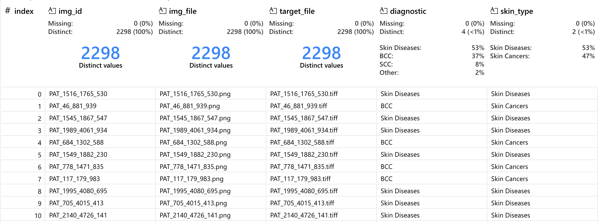
  - Skin Cancer & Skin Disease:
    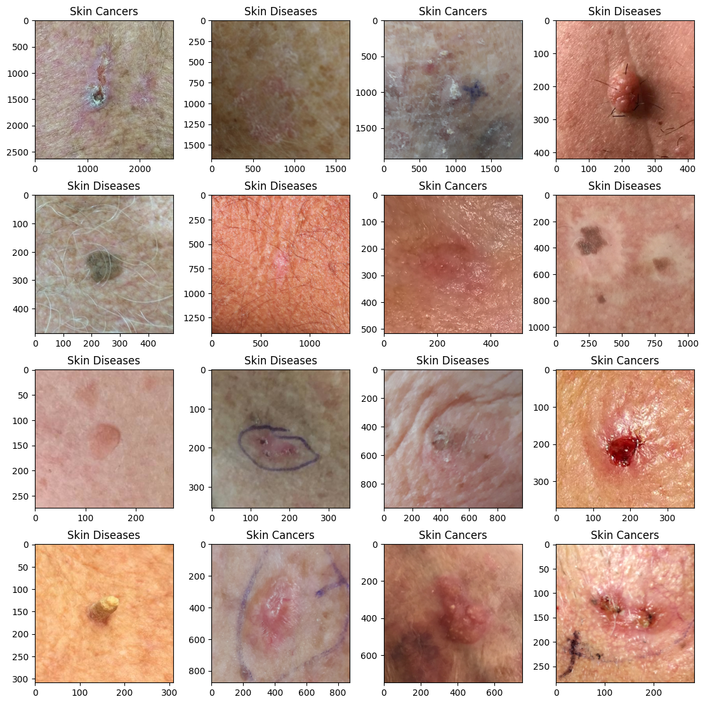
  - Skin Type:
    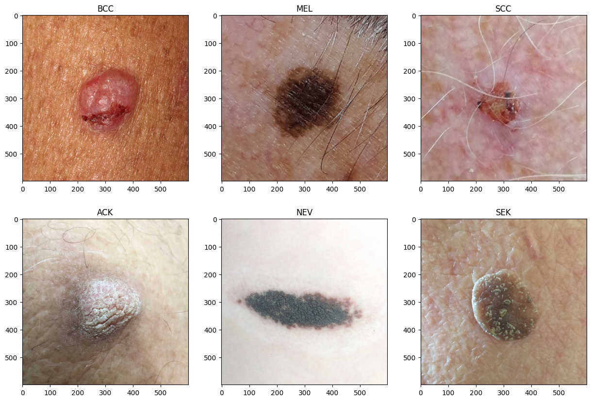

- **Random Under Sampler:** The Random Under Sampler is a data sampling technique used to balance imbalanced datasets by randomly removing samples from the majority class. This technique helps to address the class imbalance problem by reducing the number of samples in the majority class to match the number of samples in the minority class. By balancing the dataset, the Random Under Sampler can improve the performance of machine learning models and reduce bias towards the majority class.
- **Dullrazor algorithm:** Most images of skin lesions contain unwanted elements such as shadows and hairs, which can complicate lesion segmentation and introduce erroneous information about their characteristics. Therefore, it is necessary to apply some artificial vision techniques to eliminate any noise components. Body hair, in particular, can significantly affect lesion segmentation. The DullRazor algorithm is a pre-processing technique used to detect and remove hairs from skin lesion images. [Click here to learn more](https://github.com/BlueDokk/Dullrazor-algorithm)
    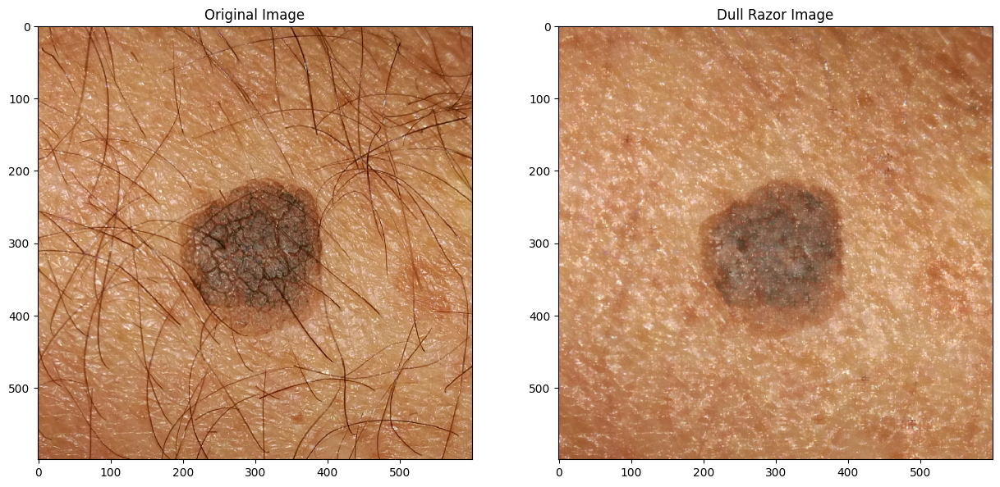
- **Image Augmentation:** Image augmentation is a technique used to artificially increase the size of a training dataset by applying various transformations to the original images. This technique helps to improve the generalization of the model and reduce overfitting by exposing the model to a wider range of variations in the training data. Common image augmentation techniques include rotation, flipping, scaling, and cropping. [Cklick here to learn more](https://www.tensorflow.org/tutorials/images/data_augmentation)
  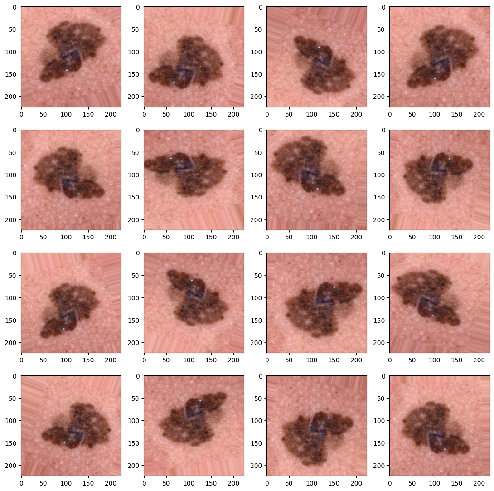
- **Transfer Learning (DenseNet121):** Transfer learning is a machine learning technique that leverages pre-trained models to solve new tasks. By using a pre-trained model as a starting point, transfer learning allows us to take advantage of the knowledge learned by the model on a large dataset and apply it to a new, related task with a smaller dataset. This approach can significantly reduce the amount of data and computational resources required to train a new model from scratch.
- **U-Net Architecture:** The U-Net architecture is a convolutional neural network (CNN) architecture that is commonly used for image segmentation tasks. The U-Net architecture consists of an encoder-decoder structure with skip connections that allow the model to capture both local and global features in the input image. The skip connections help to preserve spatial information and improve the segmentation accuracy of the model. The U-Net architecture has been widely used in medical image analysis tasks, including skin cancer detection and segmentation.
- **Image Segmentation:** Image segmentation is a computer vision technique that involves dividing an image into multiple segments or regions based on certain characteristics or features. Image segmentation is commonly used in medical image analysis to identify and delineate specific structures or objects of interest in medical images. In the context of skin cancer detection, image segmentation can be used to identify and segment skin lesions from clinical images, enabling more accurate diagnosis and treatment planning.
  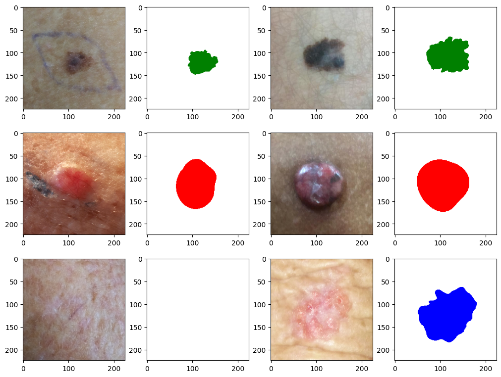
- **Evaluation Metrics:** Evaluation metrics are used to assess the performance of a machine learning model on a given task. Common evaluation metrics for image classification tasks include accuracy, precision, recall and F1 score. For image segmentation tasks, evaluation metrics such as the Jaccard index (Intersection over Union) used to measure the overlap between the predicted and ground truth segmentation masks.
  - DenseNet121:
    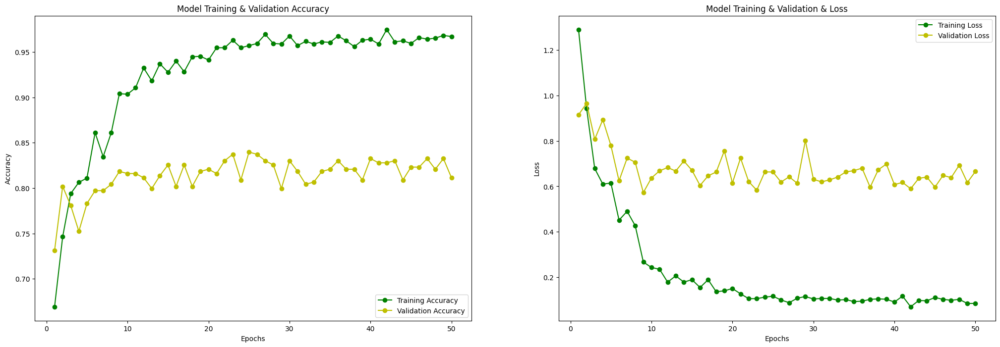
  - U-Net:
    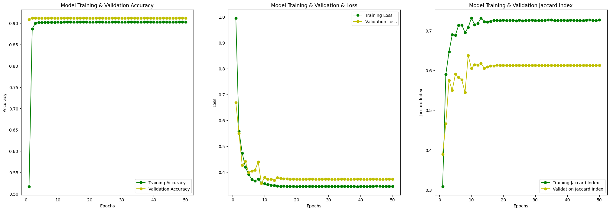
- **Image Visualizetion (GradCAM):** Gradient-weighted Class Activation Mapping (GradCAM) is a technique used to visualize the regions of an image that are important for a deep learning model's prediction. GradCAM generates a heatmap that highlights the regions of the input image that contribute most to the model's decision. By visualizing the regions of the image that the model focuses on, GradCAM can provide insights into the model's decision-making process and help to interpret and explain the model's predictions. [Click here to learn more](https://github.com/gkeechin/vizgradcam)
  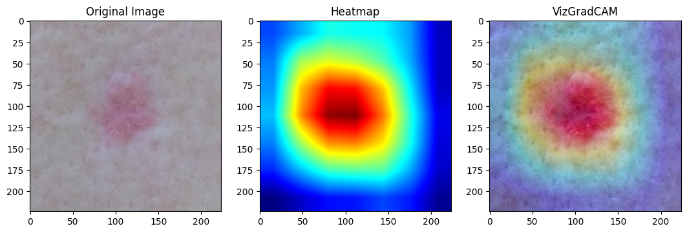
- **Model Prediction:**
  - DenseNet121:
    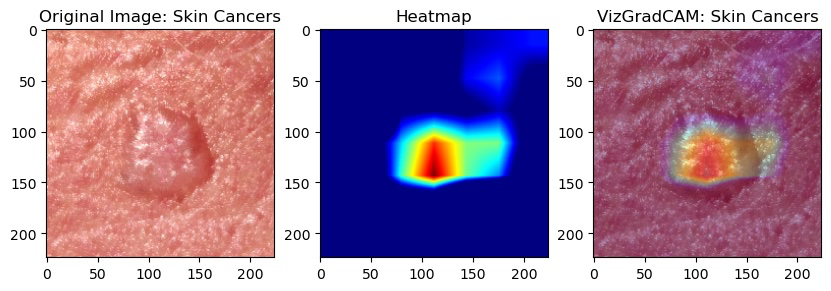
  - U-Net:
    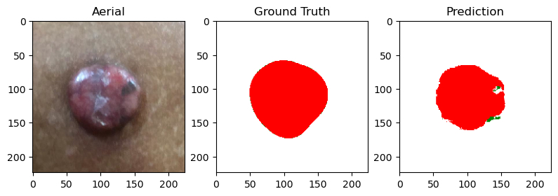
## Contributors
- Piyawat Nulek (piyawat.nulek@icloud.com)

## License
This project is licensed under the MIT License. See the [LICENSE](LICENSE) file for more details.